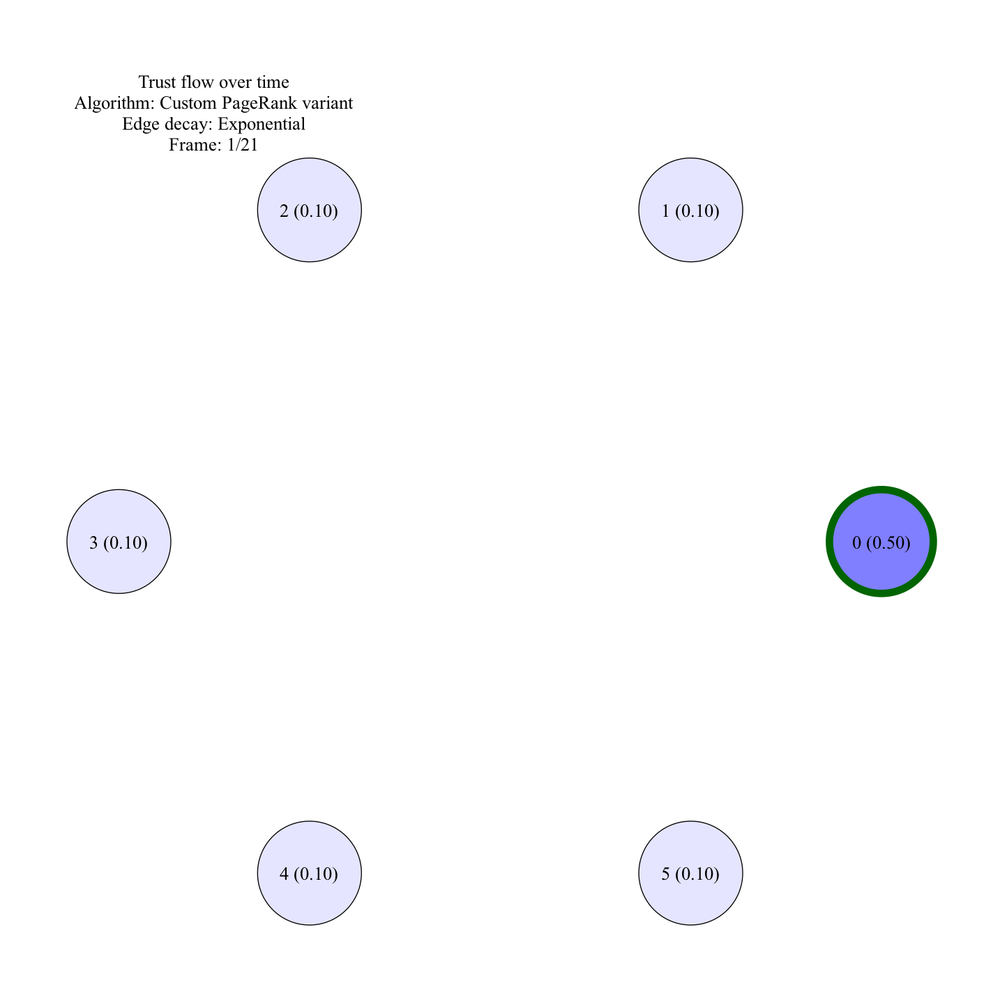

To model trust evolution, we use a dynamic, directed multigraph with decaying edge weights. In this model, agents are represented as nodes and confirmation events as edges. We choose a multigraph because there may be multiple confirmation events between two agents — these events may be separated in time and/or be of different types (such as online confirmations or confirmations after real-life interaction). A directed multigraph is used because confirmation A → B is different from confirmation B → A. We use decaying edge weights to emphasize the transient nature of confirmations — once a confirmed person becomes inactive, their account can be stolen and used maliciously. We use exponential decay as an example of an edge decay function. We use a PageRank-like algorithm to model trust propagation among experts and other agents.  The classic PageRank algorithm is helpful for modeling certain aspects of trust flow, but it does not meet all of the desired properties. For example, it initializes all nodes equally, whereas we would like the bulk of trust to flow predominantly from experts outwards. Secondly, PageRank itself is generally biased towards long-established connections, whereas we would like to de-emphasize long-established confirmations. To change those properties, we employ a custom version of the PageRank algorithm with a weighted teleportation vector instead of a uniform teleportation vector, custom dangling-node handling and time‐decaying edges, among other changes.

To create GIF locally, clone the project and run `main.sh`. Graphviz and ImageMagick are required for the routine to work.

The GIF below shows an example of temporal trust propagation from the expert, represented by the vertex with a green outline:

